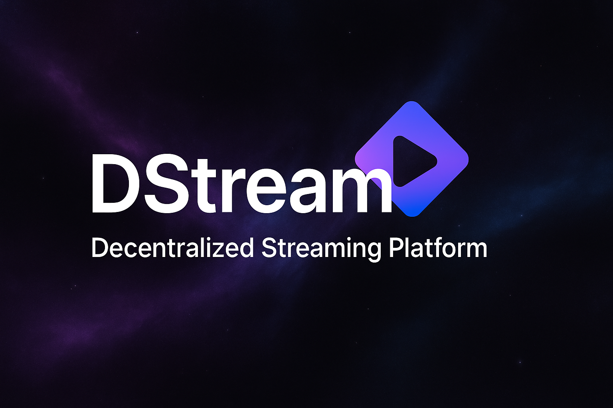
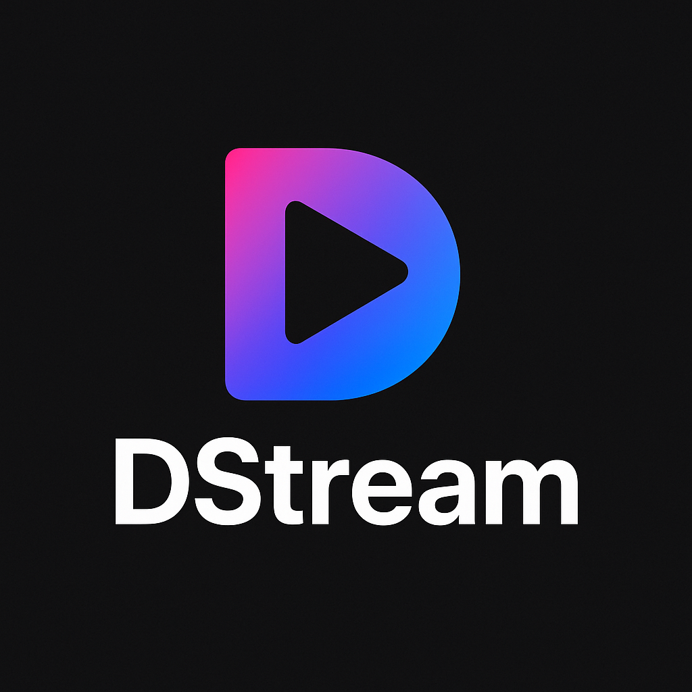

<div align="center">
  
  <br/><br/>
  
  <h1>🎬 FreeJam4U — Decentralized Streaming & Tipping Platform</h1>
  <p>
    <strong>Watch. Pay. Own.</strong><br/>
    The world’s first decentralized platform for real-time music & movie streaming powered by crypto micropayments.
  </p>
  <a href="https://www.freejam4u.com">
    
  </a>
  <a href="https://ethglobal.com/events/ethonline2025">
    
  </a>
</div>

---

## 🧠 About FreeJam4U

**FreeJam4U** is a decentralized collaborative streaming and tipping platform built for creators, musicians, and film lovers.  
It merges **real-time media synchronization**, **crypto tipping**, and **transparent blockchain analytics** into one powerful app.

- 🎧 Create or join live jam sessions or movie watch rooms.
- 💸 Tip creators directly in **PayPal USD (PYUSD)** on **Ethereum Sepolia**.
- 🔍 View every transaction transparently using **Blockscout SDK**.
- 🪩 Build playlists, persist your jams, and own your data — all on-chain.

> Think **Spotify Party + Patreon + Blockscout**, built for the decentralized era.

---

## 🌐 Live Demo

👉 [**https://www.freejam4u.com**](https://www.freejam4u.com)

Try it out:

- Join or create a streaming room
- Upload a playlist
- Tip your favorite creator
- Watch live blockchain analytics update in real time

---

## ⚙️ Tech Stack

| Layer          | Technology                                                                                |
| -------------- | ----------------------------------------------------------------------------------------- |
| 🖥️ Frontend    | [Next.js 14 (App Router)](https://nextjs.org/) + TypeScript + TailwindCSS + Framer Motion |
| ⚙️ Backend     | [Node.js](https://nodejs.org/) + Express + WebSocket                                      |
| 💰 Blockchain  | [Ethereum Sepolia Testnet](https://sepolia.etherscan.io/)                                 |
| 🧾 Payments    | [PayPal USD (PYUSD)](https://www.paypal.com/pyusd)                                        |
| 🔍 Analytics   | [Blockscout SDK](https://docs.blockscout.com/)                                            |
| ☁️ Hosting     | [Vercel](https://vercel.com) (Frontend) + [Render](https://render.com) (Backend)          |
| 💽 Persistence | MongoDB (Room metadata, playlists, track history)                                         |

---

## 💡 Key Features

### 🎧 Real-Time Jam Rooms

- Create decentralized streaming rooms for **music** or **movies**
- Watch or listen together using synchronized playback
- WebSocket-backed real-time control — instant play/pause/seek sync

### 💸 On-Chain Tipping (PYUSD)

- Secure payments via **MetaMask**
- Automatic wallet network switching to **Ethereum Sepolia**
- Each tip instantly recorded and visualized via **Blockscout SDK**

### 📊 Blockchain Tipping Dashboard

- View all PYUSD token transfers to the creator
- See total tips and individual transaction history
- Each entry links directly to **Blockscout Sepolia Explorer**

### 📁 Persistent Playlists

- Save and reload track lists across sessions
- Add new tracks or import playlists from YouTube / Spotify
- Creator-controlled synchronization with seek persistence

---

## 🧩 Architecture Overview

```
Next.js (Frontend)
├── WebSocket Client (Real-time sync)
├── Blockscout SDK (Tx popups + analytics)
├── Ethers.js (MetaMask + PYUSD tips)
└── REST API calls → Express backend

Express.js (Backend)
├── MongoDB (rooms, playlists, track history)
├── WebSocket server (synchronized media control)
└── PayPal USD & blockchain integration
```

---

## 🚀 Getting Started

### 1️⃣ Clone the Repository

```bash
git clone https://github.com/jjhbk/d-stream.git
cd d-stream
```

### 2️⃣ Install dependencies

```
# Frontend

cd frontend
npm install

# Backend

cd ../backend
npm install

```

### 3️⃣ Setup Environment Variables

Create .env files in both /frontend and /backend:

Frontend

```
NEXT_PUBLIC_API_URL=https://freejam4u.onrender.com
NEXT_PUBLIC_WS_URL=wss://freejam4u.onrender.com/ws
NEXT_PUBLIC_TOKEN_ADDRESS=0xCaC524BcA292aaade2DF8A05cC58F0a65B1B3bB9  # PYUSD on Sepolia

```

Backend

```
MONGO_URI=your_mongodb_connection_string
PORT=3001
```

### 4️⃣ Run Locally

```
# Backend
cd backend
npm run dev

# Frontend
cd ../frontend
npm run dev
```

Visit 👉 http://localhost:3000

### 🪙 PYUSD on Sepolia

To test tipping:

Get test ETH from Sepolia Faucet

Add PYUSD to MetaMask (Sepolia Testnet):

Token Address: 0xCaC524BcA292aaade2DF8A05cC58F0a65B1B3bB9
Decimals: 6
Symbol: PYUSD

Use MetaMask to send tips directly in the app.

## ⚡ Blockscout SDK Integration

FreeJam4U uses:

openTxToast() → real-time transaction success popups

openPopup() → interactive history viewer

Live data from Blockscout Sepolia API

### 🧠 Analytics Powered by Blockscout

Every tip updates instantly:

Total PYUSD tipped (real-time)

Transaction hash

Sender address

View directly on Blockscout
→ Example:
https://eth-sepolia.blockscout.com/tx/{tx_hash}

## 🌟 Future Roadmap

- 🧾 NFT membership access

- 🎨 AI playlist generation

- 🎥 WebRTC for live camera streaming

- 🌍 Full on-chain metadata storage (IPFS / Arweave)

- 💵 Fiat on-ramp for non-Web3 users

## 🤝 Contributing

We welcome all contributions!

Fork this repo

Create a feature branch

## Submit a PR 🚀

Want to integrate a new streaming source (SoundCloud, Twitch, etc.)? Jump in — let's collaborate!

## 🛠️ Author

👨‍💻 Jathin Jagannath

- 🌐 freejam4u.com

- 💾 GitHub

- 💬 LinkedIn

<div align="center"> <sub>Built for 💜 ETHGlobal Online 2025 — Empowering Creators with Decentralized Media</sub> </div>
